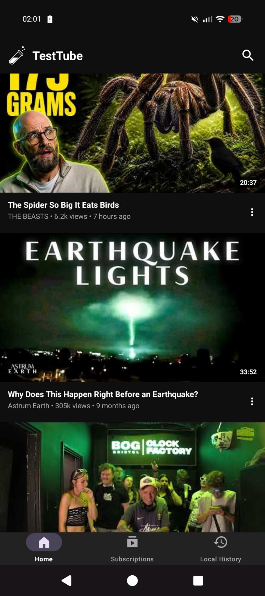
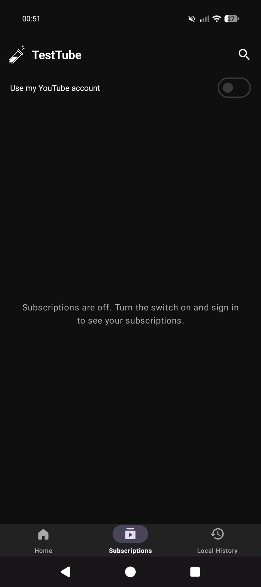
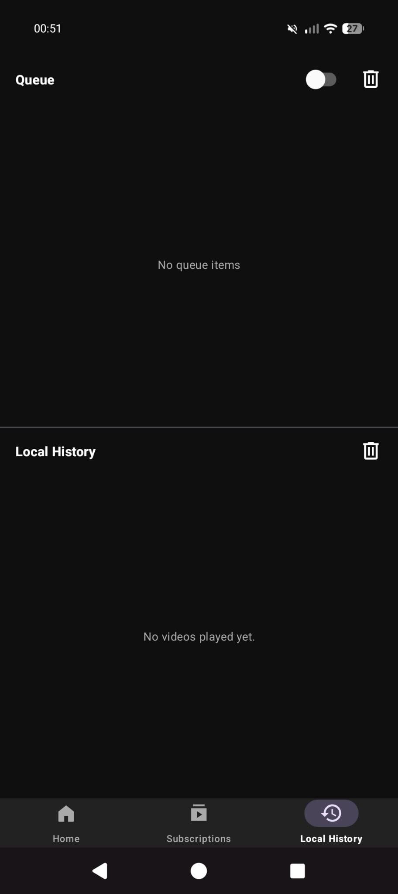

  

in a world full of excess we give you 4.5 mb of simplicity 

TestTube is an ad-free YouTube client for Android. No account needed: Home, search, subscriptions, queue and history all work without logging in. Signing in is optional and only used if you want your own YouTube subscriptions.

Requires Android 8.0 (API 26) or later.

## Features
* [x] **Works without login** (optional sign-in for your YouTube subscriptions)
* [x] **Subscriptions without an account**: follow channels from a video, by link or @handle, or import/export a list (Google Takeout, NewPipe or OPML)
* [x] **Home from your history** when signed out, and the last Home shows instantly on start
* [x] **Ad-free playback**
* [x] **Suggested videos under the player, with a next video that always plays**
* [x] **Smarter autoplay**: avoids repeating the same channel, with an "Up next" notice you can cancel
* [x] **Swipe a video right to queue it, left to follow its channel**
* [x] **Description and Comments tabs (live chat for live streams)**
* [x] **Sponsor-block**
* [x] **Mini-player support**
* [x] **Local queue support**
* [x] **Background & Picture-in-Picture support**
* [x] **Built-in video and playlist downloader**
* [x] **Watched videos greyed out**
* [x] **Local history**

## How it works

TestTube is a mix of native and web:

* **Web wrapper:** some pages are still YouTube's own mobile website, shown inside Android's WebView with TestTube's scripts and styles on top (ad blocking, greying out watched videos, and so on). This is quick to build and gives access to every YouTube page, but it depends on YouTube's page layout and is slower and heavier. The Google sign-in also uses a web page.
* **Native:** the player, the Home, Subscriptions, search and history lists, the screen under the video (Description/Comments tabs, suggestions), the queue and the downloader are drawn by the app itself and get their data directly from YouTube through the NewPipe extractor. This is faster, smoother and fully under our control.

Subscriptions come from one of two places. By default the app shows the latest videos of the channels you follow, read from YouTube's public channel feeds, so no account is involved. "Use my YouTube account" switches to your account's own subscriptions.

The mix keeps the parts you use most fast and reliable, while the web pages fill the gaps. More screens can be made native over time.

## Screenshots

## Contributing

If you encounter a bug, please check whether an issue has already been reported. If not, feel free to open a new one. Pull requests are always welcome!

## License

GPL-3.0. NewPipe Extractor is GPL-3.0-or-later.

Peace and Love
by
techniix / cuteLiLi / QuacK
