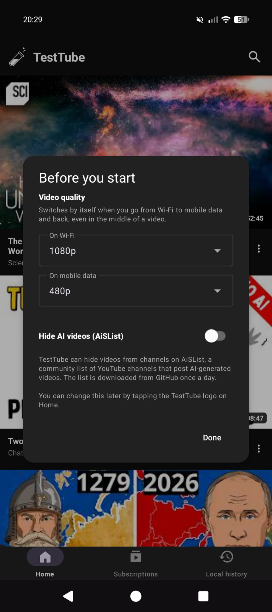
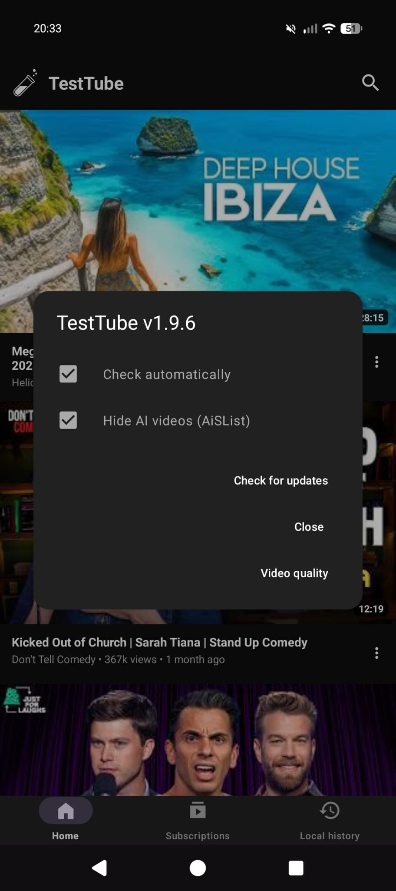

in a world full of excess we give you 4.5 mb of simplicity 

TestTube is an ad-free YouTube client for Android. No account needed: Home, search, subscriptions, queue and history all work without logging in. Signing in is optional and only used if you want your own YouTube subscriptions.

Requires Android 8.0 (API 26) or later.

## Features
* [x] **Works with or without login** 
* [x] **Subscriptions with or without an account**
* [x] **Your YouTube subscriptions** 
* [x] **Home for discovering**
* [x] **Ad-free playback**
* [x] **Swipe a video right to add it to the queue**
* [x] **Description and Comments tabs (live chat for live streams)**
* [x] **Sponsor-block**
* [x] **AI video block**
* [x] **In-app updates** 
* [x] **Local queue support**
* [x] **Background & Picture-in-Picture support**
* [x] **Built-in video and queue downloader**
* [x] **Watched videos greyed out**
* [x] **Local history**
* [x] **Light on data**
## How it works

Almost everything is native: the player, Home, Subscriptions, search, channel and playlist pages (every channel tab), History, the queue, the screen under the video (Description/Comments tabs, suggestions) and the downloader are drawn by the app itself and get their data directly from YouTube through the NewPipe extractor. This is faster, smoother and fully under our control.

Only two small web views are left: the Google sign-in page, and the live chat of live streams. There is no YouTube website layer, no injected scripts and no page bridge.

Subscriptions come from one of two places. By default the app shows the latest videos of the channels you follow, read from YouTube's public channel feeds, so no account is involved. "Use my YouTube account" switches to your account's own subscriptions.

## Privacy

* No analytics, crash reporting or ads in the app. History, queue and followed channels stay on the phone, and backups are off.
* YouTube and Google still see your IP address and the videos you watch, as with any YouTube client.
* The only other service the app contacts is Sponsor-block, which sends the first 4 characters of a hash of the video ID to sponsor.ajay.app. There are no dislike-count lookups.
* Update checks ask GitHub (api.github.com) for the latest release 5 seconds after the app starts. Nothing about you is sent, and you can switch it off by tapping the TestTube logo on Home and unticking "Check automatically".

## Screenshots

## License

GPL-3.0. NewPipe Extractor is GPL-3.0-or-later.

Peace and Love
by
techniix / cuteLiLi / QuacK
